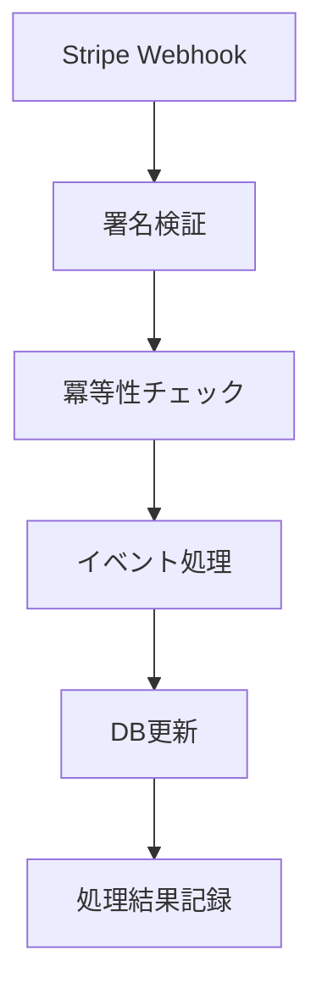

# Stripe サブスクリプション運用手順書

## 概要

本システムはStripe Subscriptionsを使用してPro プランのサブスクリプション決済を処理します。

**プラン詳細:**
- Product: `Pro`
- 月額: JPY 1,000 (30日トライアル付き)
- 年額: JPY 10,000 (30日トライアル付き)
- 機能: AI OCR (Google/Azure)

## 前提条件

- Python 3.8+
- Flask アプリケーション
- SQLite データベース
- Stripe アカウント

## 1. 初期セットアップ

### 1.1 Stripe ダッシュボード設定

1. **商品作成**
   ```
   商品名: Pro
   説明: PDF OCR Processing - Professional Plan
   ```

2. **価格設定**
   - 月額プラン:
     - 金額: ¥1,000 JPY
     - 請求サイクル: 毎月
     - 無料トライアル: 30日
   - 年額プラン:
     - 金額: ¥10,000 JPY  
     - 請求サイクル: 毎年
     - 無料トライアル: 30日

3. **Webhook エンドポイント設定**
   ```
   エンドポイントURL: https://yourdomain.com/api/stripe/webhook
   監視イベント:
   - checkout.session.completed
   - customer.subscription.updated  
   - customer.subscription.deleted
   - invoice.paid
   - invoice.payment_failed
   ```

### 1.2 環境変数設定

`.env` ファイルに以下を追加:

```bash
# Stripe 設定
STRIPE_SECRET_KEY=sk_test_xxxxx  # 本番では sk_live_xxxxx
STRIPE_PUBLISHABLE_KEY=pk_test_xxxxx  # 本番では pk_live_xxxxx
STRIPE_WEBHOOK_SECRET=whsec_xxxxx
STRIPE_PRICE_MONTHLY=price_xxxxx
STRIPE_PRICE_YEARLY=price_xxxxx
STRIPE_PORTAL_RETURN_URL=https://yourdomain.com/settings
```

### 1.3 データベースマイグレーション

```bash
# マイグレーションSQL実行
sqlite3 data/pdf_paypal.db < migrations/add_stripe_subscription_tables.sql

# または Python経由
python -c "
from database import init_db
init_db()
"
```

### 1.4 アプリケーション統合

`app.py` に以下を追加:

```python
# Stripe Blueprint 登録
from stripe_flask_integration import integrate_with_existing_app
integrate_with_existing_app(app)
```

## 2. 運用手順

### 2.1 サブスクリプション作成フロー

**ユーザー操作:**
1. ログイン後、プラン選択画面へ
2. 月額/年額プランを選択
3. `POST /api/stripe/checkout` でCheckout Session作成
4. Stripe Checkout画面で決済情報入力
5. 成功時 `/payment_success?provider=stripe` にリダイレクト

**システム処理:**
1. Checkout Session作成 (30日トライアル付き)
2. `checkout.session.completed` Webhook受信
3. `subscriptions` テーブルに記録
4. デフォルトエンタイトルメント付与

### 2.2 サブスクリプション管理

**Customer Portal:**
- URL: `GET /api/stripe/portal`
- 機能: 支払い方法変更、請求書確認、キャンセル

**管理者操作:**
```python
from entitlements import get_user_subscription_status, has_active_subscription

# ユーザーのサブスクリプション状態確認
status = get_user_subscription_status(user_id)
print(f"Status: {status['status']}, Active: {status['is_active']}")

# アクティブかどうかの簡易チェック
is_active = has_active_subscription(user_id)
```

### 2.3 Webhook処理フロー



**対応イベント:**
- `checkout.session.completed`: 新規サブスクリプション作成
- `invoice.paid`: 請求成功、期間延長
- `invoice.payment_failed`: 決済失敗、past_due状態
- `customer.subscription.updated`: ステータス変更
- `customer.subscription.deleted`: サブスクリプション削除

### 2.4 エンタイトルメント管理

```python
from entitlements import has_feature_access, grant_default_entitlements

# 機能アクセス権チェック
can_use_google_ocr = has_feature_access(user_id, 'ocr_google')
can_use_azure_ocr = has_feature_access(user_id, 'ocr_azure')

# デフォルトエンタイトルメント付与
grant_default_entitlements(user_id)
```

## 3. ローカル開発・テスト

### 3.1 Stripe CLI セットアップ

```bash
# Stripe CLI インストール
# https://stripe.com/docs/stripe-cli

# ログイン
stripe login

# Webhook転送開始
stripe listen --forward-to localhost:8080/api/stripe/webhook

# 表示されるWebhook Secret を .env に設定
# whsec_xxxxx
```

### 3.2 テスト手順

1. **Checkout テスト**
   ```bash
   curl -X POST http://localhost:8080/api/stripe/checkout \
        -H "Content-Type: application/json" \
        -d '{"plan": "monthly"}' \
        --cookie "session=..."
   ```

2. **Webhook テスト**
   ```bash
   # Stripe CLI でテストイベント送信
   stripe trigger checkout.session.completed
   stripe trigger invoice.paid
   stripe trigger invoice.payment_failed
   ```

3. **Portal テスト**
   ```bash
   curl http://localhost:8080/api/stripe/portal \
        --cookie "session=..."
   ```

### 3.3 テストカード

```
成功: 4242 4242 4242 4242
失敗: 4000 0000 0000 0002
3D Secure: 4000 0000 0000 3220
```

## 4. 監視・トラブルシューティング

### 4.1 ログ監視

```python
import logging
logger = logging.getLogger('stripe_utils')
logger.setLevel(logging.INFO)
```

**重要ログ:**
- Checkout Session 作成: `Checkout Session作成成功: session_id`
- Webhook処理: `Webhook処理成功: event_type`
- サブスクリプション更新: `サブスクリプション更新成功: subscription_id`

### 4.2 よくある問題

**1. Webhook署名エラー**
```
ERROR: Webhook署名検証: 署名が一致しません
```
- 解決: `STRIPE_WEBHOOK_SECRET` の値を確認
- Stripe CLI使用時は動的に変わるため注意

**2. 価格ID未設定**
```
ERROR: monthlyプランの価格IDが設定されていません
```
- 解決: `STRIPE_PRICE_MONTHLY`, `STRIPE_PRICE_YEARLY` を設定

**3. Customer作成失敗**
```
ERROR: Stripe顧客作成エラー
```
- 解決: APIキーの権限確認、ネットワーク接続確認

### 4.3 データベース確認

```sql
-- アクティブなサブスクリプション確認
SELECT u.username, s.status, s.current_period_end 
FROM users u 
JOIN subscriptions s ON u.id = s.user_id 
WHERE s.status IN ('active', 'trialing');

-- エンタイトルメント確認
SELECT u.username, e.feature, e.limit_value 
FROM users u 
JOIN entitlements e ON u.id = e.user_id;

-- Webhook処理履歴
SELECT event_type, processing_result, processed_at 
FROM webhook_events 
ORDER BY processed_at DESC 
LIMIT 10;
```

## 5. 本番環境デプロイ

### 5.1 事前チェックリスト

- [ ] 本番用Stripeキーに切り替え
- [ ] Webhook URL を本番環境に更新
- [ ] Customer Portal設定確認
- [ ] 税金設定（必要に応じて）
- [ ] SSL証明書設定

### 5.2 環境変数（本番）

```bash
STRIPE_SECRET_KEY=sk_live_xxxxx
STRIPE_PUBLISHABLE_KEY=pk_live_xxxxx
STRIPE_WEBHOOK_SECRET=whsec_xxxxx  # 本番Webhook用
STRIPE_PORTAL_RETURN_URL=https://yourdomain.com/settings
```

### 5.3 デプロイ後確認

1. Health Check: `GET /api/stripe/config`
2. Webhook疎通確認: Stripeダッシュボードで送信テスト
3. 実際のCheckout動作確認（小額テスト）

## 6. 料金・請求管理

### 6.1 トライアル管理

- 新規サブスクリプションには自動で30日トライアル
- トライアル期間中は課金されない
- `trial_end` 以降から課金開始

### 6.2 請求サイクル

- 月額: 毎月同日請求
- 年額: 毎年同日請求
- 失敗時は3回リトライ後 `past_due` 状態

### 6.3 キャンセル・返金

**ユーザーセルフキャンセル:**
- Customer Portal から可能
- `cancel_at_period_end=true` で期末キャンセル

**管理者操作:**
```python
# Stripeダッシュボード または CLI
stripe subscriptions cancel sub_xxxxx
```

## 7. セキュリティ

### 7.1 Webhook セキュリティ

- 署名検証必須 (`verify_webhook_signature`)
- 冪等性キー使用 (`webhook_events` テーブル)
- HTTPS必須

### 7.2 API セキュリティ

- ログイン必須エンドポイント
- CSRFトークン検証
- レート制限（必要に応じて）

### 7.3 データ保護

- 機密データ暗号化
- ログに決済情報を記録しない
- 定期的なアクセスキー更新

## 8. 参考リソース

- [Stripe Subscriptions API](https://stripe.com/docs/api/subscriptions)
- [Stripe Webhooks](https://stripe.com/docs/webhooks)
- [Stripe CLI](https://stripe.com/docs/stripe-cli)
- [Customer Portal](https://stripe.com/docs/billing/subscriptions/customer-portal)

---

**更新履歴:**
- 2025-07-28: 初版作成
- システム導入時は本手順書を最新化すること